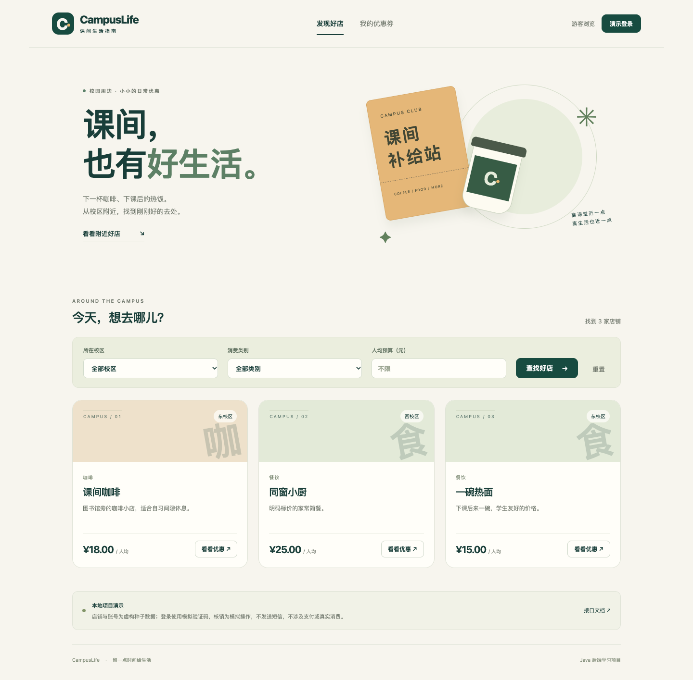
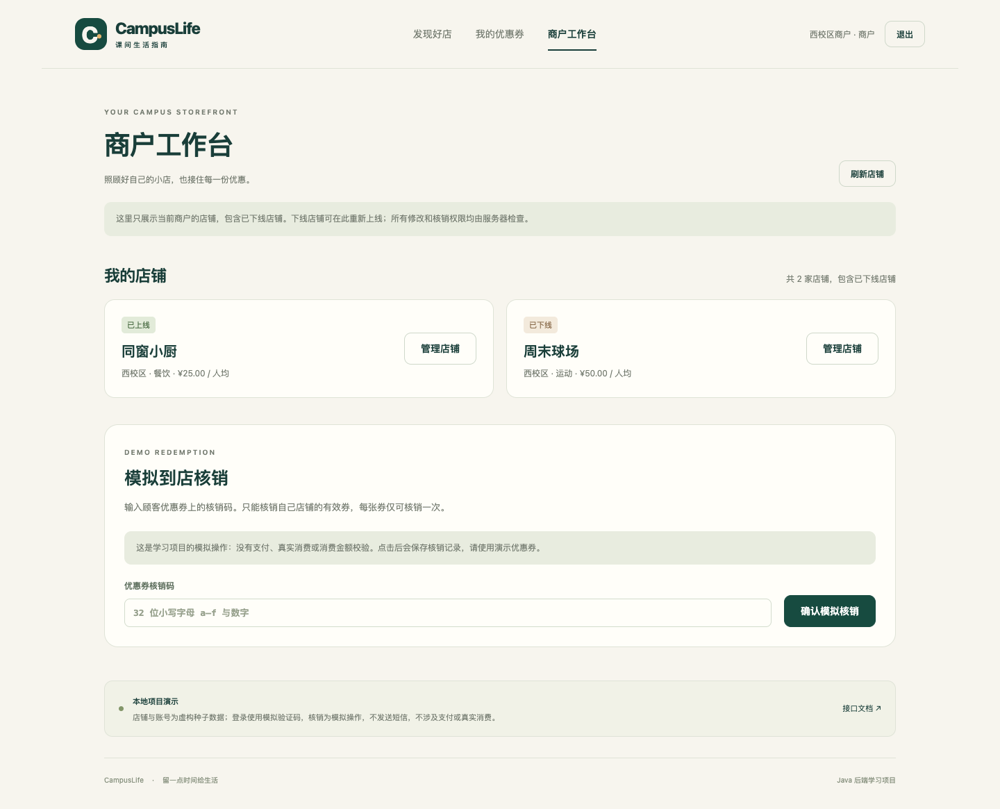
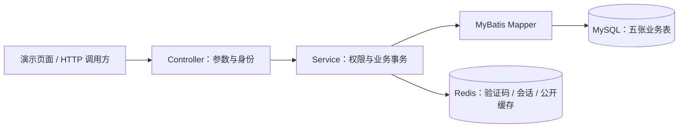

# CampusLife · 校园优惠平台

面向 Java 后端学习的校园优惠项目：学生按校区、类别和预算找店、领取限量免费券；商户管理自己的店铺并核销有效券。使用 Spring Boot 单体应用、真实 MySQL 和 Redis，附带无需单独构建的 HTML/CSS/JavaScript 演示页面。

本项目是**参考课程业务思路、在 AI 协助下实现和验证的学习参考工程**。代码与测试的存在不等于学习者已经独立掌握；个人贡献应以实际理解、修改和验证记录为准。演示数据均为虚构，没有真实运营数据或生产吞吐结论。

[快速运行](docs/setup.md) · [从零学习解析](docs/learning-guide.md) · [架构与取舍](docs/architecture.md) · [验证记录](docs/verification.md)



<details>
<summary>查看商户工作台</summary>



</details>

## 可以体验什么

| 场景 | 实现与边界 |
| --- | --- |
| 找店 | 校区、类别、预算筛选，分页，在线店铺详情；金额使用整数分 |
| 登录 | 预设账号获取模拟验证码，Redis 固定期限会话，退出登录；没有真实短信和开放注册 |
| 领券 | 条件扣库存、事务写领取记录、数据库唯一约束维护一人一券；无支付流程 |
| 我的券 | 仅查询自己的记录、核销码、到期时间和核销状态 |
| 商户管理 | 查看自己的在线/下线店铺，修改名称、均价和状态；角色、归属、版本同时校验 |
| 到店核销 | 本店商户凭核销码执行一次状态变更，拒绝越权、过期与重复核销；不检查消费订单或实付金额 |

尚未实现：商户入驻、优惠活动发布后台、支付退款、评价、真实短信、完整运营后台与云部署。`prod` 关闭模拟码和 Swagger，但未接入短信供应商，不能直接当作生产上线方案。

## 快速开始

前置条件：**JDK 21、MySQL 8.4、Redis 独立实例**。Maven 可复用已有安装，也可使用仓库 Wrapper；Wrapper 固定 Maven 3.9.16，首次从 Maven Central 下载并校验。运行 Java 应用和演示页面无需 Node.js；可选浏览器测试另需 Node.js 20+ 与 Python 3。

在下载或克隆后的项目根目录执行：

```sh
# 单元测试：只需 JDK 21 和可用的 Maven 依赖，无需数据库或 .env
./mvnw test

# 准备本地连接配置；已有 .env 时保留原文件
cp -n .env.example .env
```

按 [运行指南](docs/setup.md) 创建开发/测试库、填写本机凭据并启动 MySQL/Redis。之后有两种启动方式：

- **VS Code**：打开整个根目录，安装 Java 扩展包，选择调试配置 `CampusLife (dev)`，按 **F5**；配置会读取 `.env`。按 **Shift+F5** 停止 Java 应用。
- **macOS/Linux 命令行**：运行 `sh scripts/dev.sh run`。Windows 的 Wrapper 与配置方法见运行指南。

| 入口 | 默认地址 |
| --- | --- |
| 演示页面 | <http://127.0.0.1:8080/> |
| Swagger UI（dev） | <http://127.0.0.1:8080/docs> |
| 依赖健康检查 | <http://127.0.0.1:8081/actuator/health> |
| Prometheus 指标 | <http://127.0.0.1:8081/actuator/prometheus> |

默认仅监听本机。发布 GitHub 仓库不会自动发布网站或启动后端。

演示账号：普通用户 `13800000001`、`13800000002`；东校区商户 `13900000001`（店铺 1、3）；西校区商户 `13900000002`（店铺 2、4）。验证码由演示页面申请，不存在固定通用验证码。Flyway 首次插入示例数据，重启不会重置库存、店铺状态或领取记录。

## 三个核心设计

1. **身份和权限分开。** token 对应 Redis 服务端会话；商户读取和修改都限定自己的店铺。个人领券记录的用户 ID 来自认证结果，不相信客户端传来的身份。
2. **数据库维护权益规则。** 条件 UPDATE 防库存负数，联合唯一约束防重复领取，事务保证扣库存和新增记录同时成功或回滚。核销以状态、归属和到期时间共同约束一次状态变更。
3. **公开缓存允许短暂旧值。** 店铺详情采用 Cache Aside、空值缓存、TTL 抖动和提交后失效；缓存故障可查数据库。身份验证依赖 Redis，故障时拒绝受保护操作。没有承诺缓存强一致。



Java 21 · Spring Boot 3.5.16 · MyBatis Starter 3.0.5 · MySQL 8.4 / InnoDB · Redis · Flyway · JUnit 5 / Mockito · Actuator / Micrometer。精确依赖见 [pom.xml](pom.xml)。

## API 概览

业务响应统一为 `{code,message,data,requestId}`；受保护接口使用 `Authorization: Bearer <token>`。金额为分，数据库与 API 时间约定为 UTC。

| 方法与路径 | 用途 / 权限 |
| --- | --- |
| `POST /api/auth/code`、`POST /api/auth/login` | 申请模拟码、登录 |
| `GET /api/auth/me`、`POST /api/auth/logout` | 当前身份、退出 |
| `GET /api/shops`、`GET /api/shops/{id}` | 公开在线店铺列表、详情 |
| `GET /api/merchant/shops`、`GET /api/merchant/shops/{id}` | 本商户在线/下线店铺列表、详情 |
| `PATCH /api/shops/{id}` | 本店商户修改；必填 version |
| `GET /api/shops/{shopId}/vouchers` | 店铺当前可领取活动 |
| `POST /api/vouchers/{id}/claims` | 登录后领券，无请求体 |
| `GET /api/me/vouchers` | 查询自己的券 |
| `POST /api/merchant/vouchers/redemptions` | 本店商户核销；请求体为 `{redeemCode}` |

核销成功返回 `REDEEMED` 与 `redeemedAt`，不返回完整核销码或用户身份。过期和重复核销分别返回 409 `VOUCHER_EXPIRED` / `ALREADY_REDEEMED`。接口完整字段及错误响应可在本地 Swagger 查看。

## 测试与打包

```sh
./mvnw test                    # 单元测试，无需 .env / MySQL / Redis
sh scripts/dev.sh test         # 真实 HTTP / MySQL / Redis 集成验证
./mvnw package                # 单元测试与可执行 JAR 打包
# 可选浏览器检查：先按 docs/setup.md 安装测试依赖和浏览器
npm run test:e2e
```

集成测试会重置专用的 `campuslife_test` 数据库和 Redis DB 1 下的 `campuslife:test:` 前缀。测试保护在 Flyway 前验证连接目标；不要在测试库保存有价值的数据。报告目录为 `target/surefire-reports/`、`target/failsafe-reports/` 和 `target/site/jacoco/`，可执行包为 `target/campuslife-1.0.0.jar`。

可选 Playwright 浏览器检查使用独立测试应用和真实 MySQL/Redis，覆盖页面业务流程；运行方法与清理范围见 [运行指南](docs/setup.md)。不要与 Maven 集成测试并行执行，因为两者使用同一个专用测试库。

[验证记录](docs/verification.md) 区分执行日期、代码版本、历史结果与限制。并发库存正确性测试不等于 HTTP 吞吐压测；本机指标不作为生产 QPS。仓库提供 [GitHub Actions](.github/workflows/verify.yml)，是否远程通过以实际 workflow run 为准。

2026-10-03 本地验证：**68 项单元测试、38 项真实服务集成测试、12 个浏览器场景通过**；不含 `.env` 的干净源码副本也通过 Wrapper 打包。完整环境、源码摘要与边界见验证记录，尚未执行远程 GitHub CI。

## 代码与阅读顺序

```text
src/main/java/com/campuslife/
  auth/       验证码、会话与身份
  shop/       公开查询、商户管理、缓存
  voucher/    领券、个人权益、核销
  common/     响应、异常、请求编号
src/main/resources/
  db/         Flyway 迁移与虚构示例数据
  static/     演示页面
src/test/     单元测试、真实服务集成测试与测试保护
scripts/      运行与验证入口
docs/         学习、架构、运行、验证说明
```

初次学习先读 [学习解析第 1～4 节](docs/learning-guide.md)，跟踪 `ShopController → ShopService → ShopMapper`；再读登录、领券和核销事务。[面试讲解](docs/interview.md) 和 [简历参考](docs/resume.md) 应在独立理解与练习之后使用。

## 来源与后续方向

业务思路参考 [黑马点评 / Redis 课程](https://www.bilibili.com/video/BV1cr4y1671t/)，Web 分层学习参考 [JavaWeb / Tlias](https://www.bilibili.com/video/BV1yGydYEE3H/)。详细设计来源与取舍保留在 [项目思路与设计理由](CampusLife项目思路与设计理由.md)。校园筛选、商户权限、事务规则与验证实现，应结合实际改动说明贡献。

后续可做：优惠活动发布管理、可复现的大数据量 SQL 优化实验、扩展浏览器流程覆盖、Linux 部署与回滚。以上不算已实现能力。仓库尚未声明项目许可证；课程和第三方依赖各自的权利与许可仍需遵守。
