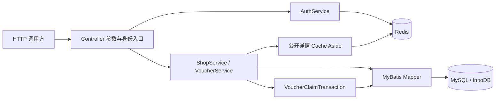
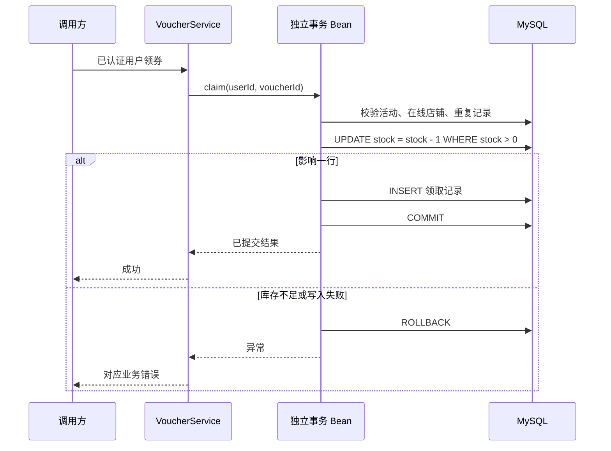

# CampusLife 架构与一致性

本文描述当前仓库代码。项目是校园优惠教学用单体后端，附带原生演示前端，覆盖领券、个人记录、商户店铺维护与一次性核销；支付、评价、完整运营后台与生产部署不在当前实现范围。

## 请求如何经过系统

Controller 接收参数，受保护入口调用 `AuthService.requireUser` 获取服务端身份；Service 集中业务规则与事务；Mapper 使用绑定参数执行 SQL。Redis 保存短期身份信息与可重建的公开详情，MySQL 保存业务事实。业务代码没有用内存集合替代持久化。

接口统一返回 `ApiResponse`。`RequestIdFilter` 生成请求编号，写入 MDC 和 `X-Request-Id`；登录、我的券、领券响应带 `Cache-Control: no-store`。异常处理把参数、权限、业务冲突和依赖故障映射成不同 HTTP 状态。

`src/main/resources/static/` 中的 HTML、CSS、JavaScript 由同一 Spring Boot 应用提供，无单独 Node 构建或前端服务。页面通过同源 Fetch 调用 API，支持筛选、详情、模拟验证码登录、领取、我的券与商户编辑；价格录入由元转换为整数分，UTC 时间转换为浏览器本地时间。token 保存在标签页 sessionStorage，页面显示不替代后端权限检查。“商户工作台”仅对商户显示，通过自有列表管理在线与下线店铺，允许重新上线；同页提供模拟核销表单。独立管理弹窗先从受保护 GET 取得详情，跨商户 403 时不显示编辑表单。没有商户入驻或优惠活动发布后台。

## 五张业务表

| 表 | 事实与关键约束 |
| --- | --- |
| users | 预设用户身份；phone 唯一，role 只能 USER/MERCHANT |
| shops | 商户归属、校区、类别、均价、状态、version；外键关联 users |
| vouchers | 优惠面额、门槛、领取窗口、使用截止；外键关联 shops |
| voucher_stock | 每张券的剩余/初始库存；主键为 voucher_id，约束 `0 <= stock <= initial_stock` |
| voucher_orders | 领取记录；`UNIQUE(user_id,voucher_id)`、核销码唯一；保存领取时的 expires_at，以及 redeemed_at / redeemed_by |

外键维护关联，检查约束维护角色、状态、金额和日期基本边界。应用规则仍需独立校验，不能把“有表约束”当作已完成整个业务。`voucher_orders` 名称中的 orders 表示免费券领取记录，没有支付流水或退款语义。记录状态为 `ISSUED` / `REDEEMED`；核销时间与操作者必须随状态一起写入。过期通过期限判断，不会由定时任务自动写成第三种状态。V901 新迁移增加核销字段和一致性约束，保留既有 V1/V900 与历史领取记录。

金额使用整数分。`Clock.systemUTC()`、JDBC 连接时区、MySQL 会话时区按 UTC 对齐；`DATETIME(6)` 本身没有时区，Java `LocalDateTime` 也没有，双方遵守同一 UTC 约定。领取时刻截断到微秒，匹配数据库精度；领取有效窗口是 `[claimStart, claimEnd)`，并要求早于 useEnd。

Flyway 管理结构版本；dev/test 额外加载虚构种子数据，prod 不自动插入演示种子。Flyway 的迁移历史表是工具元数据。开发库已执行 V900，不能直接切换 prod profile 复用该库，因为 prod 不加载对应的 dev 迁移位置；应使用独立数据库和明确的迁移、初始化方案。

当前 Flyway 11.7.2 对 MySQL 8.4 启动时有超出已测试数据库版本范围的提示。本机结构迁移和真实集成验证已通过，但这属于本地验证结果，不是官方兼容性认证，具体证据见 [验证记录](verification.md)。

## 身份验证与权限

模拟验证码只在 `app.auth.dev-code-enabled=true` 且有效 profile 全部属于 dev/test 时启用。默认配置显式以 dev 作为默认 profile，dev 配置开启模拟码；prod 配置关闭模拟码。当前没有短信供应商，所以非演示环境申请验证码返回 `SMS_PROVIDER_NOT_CONFIGURED`。

验证码默认有效 120 秒，同手机号发送冷却 60 秒，最多允许 5 次错误尝试。Redis Lua 把发送与冷却检查放在同一原子操作，把校验、尝试次数与成功删除放在另一个原子操作，避免一个正确码被两个请求同时消费。错误尝试不续期；test profile 将发送冷却设为 0，便于隔离测试场景。

登录成功生成 32 个安全随机字节，并以无填充 Base64URL 形式返回 token。Redis key 使用 token 的 SHA-256 摘要，value 保存服务端读取的用户身份，默认固定有效期 7200 秒。读取会话不延长有效期，退出只删除本次 token 对应会话。这里使用服务端会话，没有叠加 JWT 或滑动续期。

服务端从种子账号表读取角色。商户查询和 PATCH 要同时满足已登录、MERCHANT、`merchant_id == user.id`；管理列表从服务端身份限定 merchant_id，包含在线/下线店铺，直接读取数据库，不走公开详情缓存；“我的券”始终由认证身份限定 user_id，不能靠客户端传来的用户编号扩大查询范围。当前会话保存的是登录时身份快照；未来若支持实时改角色，需要另外设计撤销或刷新规则。

## 查询的一致性与索引

店铺列表只查 `status=1`，campus/category 使用等值条件，`average_price <= maxPrice` 包含价格等值边界；空白筛选值视为未筛选。列表按 id 升序，分页数据与 count 使用相同条件，在同一个只读 REPEATABLE_READ 事务中查询。

店铺有效优惠按 `claim_end ASC,id ASC`，我的券按 `created_at DESC,id DESC`；这两个列表也使用只读 REPEATABLE_READ。并列值增加 id 作为确定顺序，不依赖数据库的偶然返回顺序。这里的一致视图只覆盖**单次请求**；不同翻页请求之间仍可能有新增、修改或下线，不是跨请求冻结快照。Offset 分页适合本练习规模，深分页仍有扫描成本。

主要索引是：

| 索引 | 目的与限制 |
| --- | --- |
| shops `(status,campus,category,average_price,id)` | 为常见等值筛选和预算范围缩小扫描范围；省略中间列时利用情况会变化，不能保证顺便满足所有排序 |
| shops `(merchant_id)` | 支持按商户归属访问 |
| vouchers `(shop_id,status,claim_end)` | 缩小店铺有效活动候选集，其他时间条件仍需过滤 |
| voucher_orders `(user_id,created_at DESC,id DESC)` | 支持个人记录的稳定倒序查询 |
| voucher_orders 唯一 `(user_id,voucher_id)` | 数据库守住一人一券，也支持重复领取查找 |

只有查询计划、实际数据分布与测量才能证明优化收益。本仓库没有据“建立索引”推导吞吐提升百分比。

## 店铺详情缓存与修改

缓存 key 为 `${app.redis-prefix}shop:detail:<id>`。仅缓存公开 `ShopView` 字段，不含 merchantId、核销码或个人领取记录。

读取流程：Redis 有合法详情则命中；命中 `__NULL__` 则返回 404；未命中或 JSON 缺字段/损坏则读取在线店铺并回填。正常详情 TTL 为 300–330 秒，空结果为 30 秒。轻量随机 TTL 只能分散部分同时过期，不能保证热点不会同时回源。

Redis 读失败时直接查库，并跳过本次回填；写缓存失败仍返回数据库结果。日志只记录操作类别和异常类型，不输出缓存正文或连接凭据。Micrometer 指标 `campuslife.shop.cache` 通过 result 标签分别统计 hit/miss/fallback；fallback 表示缓存操作失败次数，可能来自读取、写入或提交后的删除，不是“请求降级率”的直接同义词。

商户修改在数据库事务内先检查归属与版本，再执行带 `id/merchant_id/version` 条件的 UPDATE，递增 version。影响行数不是 1 则返回 `VERSION_CONFLICT`。客户端必须提交 version，且只能修改 name、averagePrice、status，不能提交 merchantId 等额外字段。

通过 `TransactionSynchronization.afterCommit` 在成功提交后删除详情缓存。数据库回滚不删除缓存；提交后删除失败只记录告警和 fallback 指标，不能把已经完成的数据库修改虚报为失败。

这里提供的是有限的最终一致性：并发旧读可能在删除后重新填入旧值，Redis 删除可能失败，读请求也可能在事务提交前取得旧缓存。TTL 提供后续恢复机会，**没有承诺任意时刻强一致，也没有严格保证修改后多少毫秒内所有读取都刷新**。当前未实现延迟双删、更新事件、缓存版本门禁或热点互斥重建。

## 领券事务与并发规则

`VoucherClaimTransaction.claim` 使用 READ_COMMITTED。库存扣减通过数据库条件 UPDATE 原子完成，不用“先读 stock 再减一并覆盖”来防超卖。扣库存与插入领取记录位于同一事务；插入失败必须抛出异常，库存才能随事务回滚。

领取前查重提供清晰提示，数据库唯一约束处理并发漏网请求。扣库存返回 0 时再查一次当前用户是否已领，READ_COMMITTED 使该查询能看到刚刚提交的并发领取，帮助区分“本人已经成功”和“确实售罄”。

事务放在单独 Spring Bean，是为了让代理事务边界真实生效，并让 `VoucherService` 在事务已经回滚后处理 `DuplicateKeyException`。只有回滚后确实存在当前 user_id/voucher_id 记录，才映射为 `ALREADY_CLAIMED`；随机订单 ID 或核销码碰撞不能冒充重复领取。

事务提交成功后才返回成功。客户端若在提交后断网，可能不知道结果，应重新查询自己的券；再次领取会得到重复领取响应，当前没有额外的客户端幂等键协议。领取结果在 MySQL 中持久保存，店铺后续下线也不删除历史权益。商户下线与领券并发时，没有承诺跨事务的瞬时撤销规则。

## 核销状态、权限与并发

`POST /api/merchant/vouchers/redemptions` 接收 32 位小写十六进制核销码；`VoucherRedemptionService.redeem` 在 READ_COMMITTED 事务中操作。认证身份必须为商户，`SELECT ... FOR UPDATE` 锁定领取记录，再查询店铺归属，先检查归属、后判断已核销与过期，避免向其他商户返回权益状态详情。

当前时间在取得行锁后读取，按 UTC 截断到微秒；要求 `now < expires_at`，期限来自领取时的快照。条件 UPDATE 同时限定 `ISSUED`、未过期和店铺商户归属，写入 `REDEEMED`、`redeemed_at`、`redeemed_by`。数据库 CHECK 约束保证未核销状态没有核销字段，已核销状态同时具备有效时间和操作者；外键关联核销人。

同一券并发核销在行锁上串行检查：成功提交后，其他请求返回 `ALREADY_REDEEMED`。过期返回 `VOUCHER_EXPIRED`，更新条件意外不匹配返回 `REDEMPTION_CONFLICT`，均为 409；其他店铺或普通用户返回 403。返回对象只含记录/券/店铺标识、标题、状态与核销时间，不回传完整核销码或用户身份。私有接口不通过公开缓存。

核销不再次扣库存，不因商户下线或活动关闭而撤销已发出的有效权益。它记录商户确认使用，不包含支付、消费金额与满减门槛验证。未实现撤销核销、追加操作审计表、消费订单或退款流程；重复调用返回冲突，不宣称实现了返回同一成功响应的客户端幂等键协议。

## 故障、配置与验证边界

公开详情 Redis 故障可以回源，因为 MySQL 保存公开事实；身份 Redis 故障返回 `AUTH_UNAVAILABLE`，不能跳过身份校验。数据库访问异常返回 `DEPENDENCY_UNAVAILABLE`。MySQL 和 Redis 在这套本机环境都是单实例，没有故障自动切换、跨地域容灾或生产运维承诺。

业务与静态前端监听 8080，管理监听本机 8081。VS Code 在项目根目录通过 `CampusLife (dev)` 配置 F5 启动，envFile 自动加载 `.env`，Shift+F5 停止应用；MySQL/Redis 需提前启动，跨平台配置见 [运行指南](setup.md)；`local-services.py` 仅适配已有 Mac 用户目录布局。`.env` 被 Git 忽略，其内容不应进入文档或测试报告。

dev/test/prod 使用不同 Redis 前缀，集成测试另用 Redis DB 1 和专用 MySQL 测试库。测试保护在 Flyway 运行和 Bean 初始化前验证数据库名精确为 `campuslife_test`、Redis DB 为 1、前缀为 `campuslife:test:`，并阻止绕过已校验连接的替代配置。管理指标仅导出，仓库没有部署 Prometheus 采集服务或告警平台。

测试代码包含身份与并发验证码、店铺筛选/权限/缓存/乐观更新、商户私有列表、领券重复/库存竞争/插入失败回滚、个人记录隔离及核销权限/过期/并发等场景。单元测试验证分支和失败处理；集成测试通过真实 HTTP、MySQL 与 Redis 验证事务和约束。历史本机记录包含 VS Code 启动、健康接口与 HTTP 冒烟检查；执行版本和最新结果见验证记录，HTTP 检查不代表完整浏览器交互覆盖。并发业务正确性测试不等于吞吐压测；完整结果和环境限制见 [验证记录](verification.md)，不能从测试名称推断结果。

可选浏览器验证使用 Playwright 与 Python 驱动，临时启动经过同样测试环境保护的 Java 应用，在重置后的专用测试库执行真实页面流程；不依赖开发应用，也不读日常浏览器登录状态。它需要额外的 Node.js 20+ / Python 3，但不是应用运行依赖。运行方法见 [运行指南](setup.md)，实际通过范围以验证记录为准。
