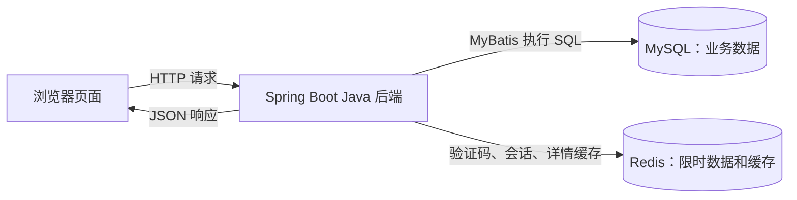

# CampusLife 项目学习解析：从第一次使用到读懂核心代码

这份文档面向第一次接触本项目的你。目标是让你能说清它做什么、一次请求经过哪里、数据怎样保存，以及核心代码为什么这样写。内容以当前项目源码为准；示例中的店铺和账号都是虚构的开发数据。

**第一次阅读先看第 1～4 节，再亲手完成第 10 节的前两个练习。** 看完一条查询链路后，再学习登录、缓存和领券事务。不需要先背会全部框架术语。

阅读顺序：业务场景 → 系统组成 → 文件位置 → 查店铺 → 登录 → 数据表 → 缓存与权限 → 并发领券与核销 → 测试 → 动手练习。

## 1. 这个项目究竟做什么

CampusLife 是一个校园周边优惠平台。你可以把它理解为一个简化的“校园优惠店铺目录”：学生查找店铺、领取免费优惠券，商户管理自己的店铺并核销有效券。

用项目中的真实种子数据举例：林同学在东校区，想找人均不超过 18 元的咖啡店。他筛选后找到“课间咖啡”，进入详情，看见“咖啡满 20 减 5”的优惠活动，登录后领取一张券，再到“我的优惠券”中确认领取结果。

这里有两个不同的金额：**18 元是店铺人均价格，20 元是优惠券使用门槛**。筛选人均价格不等于检查某笔消费能否使用优惠券。当前项目没有消费订单和付款流程，也没有实际执行“满 20 减 5”的结算。

### 谁可以做什么

| 身份 | 能做的事情 | 不能仅凭这个身份做的事情 |
| --- | --- | --- |
| 游客 | 筛选店铺、查看公开详情和优惠活动 | 领取优惠券、查看个人领取记录 |
| 已登录普通用户 | 领取优惠券、查看自己的券、退出登录 | 修改店铺、查看别人的核销码 |
| 已登录商户 | 具有基本登录能力，还能管理自己的在线/下线店铺，核销本店有效券 | 修改其他商户的店铺、核销其他店铺的券 |

本项目完成的是“找到店 → 领到券 → 查到自己的券 → 本店商户核销”。核销记录商户确认使用的结果，不接入消费订单，不核验满减门槛或实付金额。短信发送、开放注册、支付、退款、商户入驻和优惠活动发布后台尚未实现。

**学这个项目的重点，是把一条小业务做正确。** 例如：别人能不能改我的店？同一个人点两次会不会多领？最后一张券会不会发给两个人？这些问题比单纯“写出一个返回成功的接口”更接近后端工作。

### 首次体验的账号

| 页面中的账号 | 手机号 | 后端身份 |
| --- | --- | --- |
| 林同学 | `13800000001` | 用户 1 |
| 陈同学 | `13800000002` | 用户 2 |
| 东校区商户 | `13900000001` | 商户 101，拥有店铺 1、3 |
| 西校区商户 | `13900000002` | 商户 102，拥有店铺 2、4 |

页面中的“获取模拟码”会返回开发环境生成的验证码，不会发送短信。账号预先保存在数据库里，随便输入一个新手机号不会自动注册。

之前的验证可能已经使用某个演示账号领取过券。再次领取出现“你已领取过该优惠券”是正常业务结果；重启应用也不会把领取记录清空。

## 2. 页面、Java、MySQL、Redis 怎样配合

先分清“你操作的工具”和“真正运行的服务”：

| 名称 | 在本项目中的工作 | 一个容易理解的例子 |
| --- | --- | --- |
| VS Code | 编辑代码、启动和调试 Java | 按 F5 运行，打断点查看变量 |
| JDK / Java | 编译和运行 Java 程序 | 执行后端的业务判断 |
| Maven | 按 `pom.xml` 管理依赖、编译、测试、打包 | 下载 Spring Boot 依赖，生成 JAR |
| Spring Boot 应用 | 接收浏览器请求，执行后端逻辑，提供页面文件 | 判断是否允许领券 |
| MyBatis | 把 Java 方法与 SQL、查询结果连接起来 | 调用 `findOnline(1)` 得到店铺数据 |
| MySQL | 保存用户、店铺、活动、库存、领取记录 | 应用重启后，之前领的券仍然存在 |
| Redis | 保存限时验证码、登录会话和公开详情缓存 | 找到 token 对应的身份，或快速返回店铺详情 |

运行时，你的电脑上有 Java 应用、MySQL 服务、Redis 服务。**把工具安装好，不等于它们的服务此刻正在运行。** Maven 也不是一个需要一直开着的数据库服务。



用文字读这张图：页面收集你的操作，通过 HTTP 找后端；后端检查规则，再访问需要的数据；最后把结果返回页面。浏览器不会直接连接 MySQL，也不会因为你在页面上写了某个用户编号，就自动获得那个用户的权限。

### HTTP、接口、JSON、端口分别是什么

`http://127.0.0.1:8080/api/shops/1` 可以拆成几部分：

- `127.0.0.1`：当前这台电脑。
- `8080`：这台电脑上 Java 应用接收业务请求的端口。
- `/api/shops/1`：告诉应用“我要访问编号为 1 的店铺”。
- `GET`：这次请求的方法，通常用于读取资源。

**接口（API）**就是程序对外提供的入口。调用同一个地址时，GET 用来查，PATCH 可以用于修改；具体允许哪些方法，由 Controller 中的配置决定。

**JSON**是一种传递数据的文本格式，比如 `{"name":"课间咖啡","averagePrice":1800}`。页面拿到这些数据，再把名字、价格画成你看到的卡片。数据库中的金额使用整数“分”，因此 `1800` 表示 18 元；页面的 `toCents` 和 `money` 函数负责转换。

首页 `/` 返回 HTML 页面，`/api/shops` 返回业务 JSON。两者由同一个 Spring Boot 应用提供，所以运行本项目不需要额外安装 Node.js 或启动一个前端开发服务器。可选的 Playwright 浏览器测试才需要 Node.js 20+ 与 Python 3，见 [运行指南](setup.md)。

默认端口是：业务及页面 8080，健康检查和指标 8081，MySQL 3306，Redis 6379。当前配置只允许本机访问，不是已经发布到互联网的网站。

## 3. 打开项目后，先看哪些文件

项目根目录是你克隆或下载后含 `pom.xml` 的 `CampusLife` 文件夹。先认下面这些位置，不必一次把所有文件都读完。

| 位置 | 先把它理解为 |
| --- | --- |
| [pom.xml](../pom.xml) | 项目的构建说明和依赖清单 |
| [CampusLifeApplication.java](../src/main/java/com/campuslife/CampusLifeApplication.java) | Java 应用的启动入口 |
| `src/main/java/com/campuslife/shop/` | 查店、缓存店铺详情、商户修改 |
| `src/main/java/com/campuslife/auth/` | 模拟验证码、登录、会话验证与退出 |
| `src/main/java/com/campuslife/voucher/` | 优惠活动、领券、我的券、商户核销 |
| `src/main/java/com/campuslife/common/` | 各模块共用的响应格式、异常处理、请求编号 |
| [application.yml](../src/main/resources/application.yml) | 应用端口、数据库连接、Redis 等配置 |
| `src/main/resources/db/` | 建表和开发演示数据的 SQL |
| `src/main/resources/static/` | 页面：HTML 结构、CSS 样式、JavaScript 操作逻辑 |
| `src/test/` | 验证业务规则和失败情况的自动化测试 |
| [launch.json](../.vscode/launch.json) | VS Code 按 F5 时启动什么、从哪里加载环境变量 |
| `target/` | 编译、测试、打包生成的结果，不是主要源码目录 |
| `.env` | 本机连接凭据；不需要打开它来学习业务，不要把内容贴进笔记或提交到仓库 |

JDK、Maven、MySQL、Redis 可以复用全局或用户级安装，数据库数据也不放在源码目录里；Maven Wrapper 使用正常的用户 Maven 缓存。源码文件夹可以集中管理项目，其他文件夹中的 Java 项目也能复用已安装工具。

### Controller、Service、Mapper：先记住三个职责

以店铺模块为例：

```text
ShopController  接住 HTTP 请求、取出参数
      ↓
ShopService     检查和处理业务规则
      ↓
ShopMapper      调用对应的 SQL
      ↓
MySQL           保存、查询实际数据
```

同一个需求分在三个文件中，是为了让职责明确。比如新增预算范围校验，应该在业务处理处考虑；调整数据库查询，去 Mapper；改接口地址，去 Controller。这样修改一件事时，容易知道需要检查哪些地方。

### Java 对象为什么不用自己到处 `new`

在 [ShopController](../src/main/java/com/campuslife/shop/ShopController.java) 中可以看到这段原始代码：

```java
public ShopController(ShopService shops, AuthService auth) {
    this.shops = shops;
    this.auth = auth;
}
```

构造方法说明：“我要工作，需要一个店铺服务和一个身份服务。”Spring 在启动时管理这些对象，并把对应对象交给构造方法。这叫**依赖注入**；被 Spring 管理的对象通常称为 **Bean**。第一遍先理解“由框架把对象接起来”，不必先学习容器源码。

`@Service` 标出服务组件，`@RestController` 标出 Web 接口入口，`@Mapper` 让 MyBatis 为数据访问接口提供实现。它们都是 Java 注解：代码旁边的元信息，需要相应框架来识别，并不是写一个注解就凭空多出业务逻辑。

`ShopRow`、`ShopView`、`UserPrincipal` 等使用 Java `record`。这里可以先把 record 理解成携带一组字段的数据对象：`row.id()` 是取出 id，`user.role()` 是取出角色。它不是数据库表，也不会自动把数据存入数据库。

## 4. 沿着第一条请求走：筛选咖啡店

假设你选择“东校区”“咖啡”，预算输入 `18`。页面会把元转成分，并发送类似下面的请求。URL 中中文实际会进行编码；此处为便于阅读保留中文。

```http
GET /api/shops?campus=东校区&category=咖啡&maxPrice=1800&page=1&size=6
```

### 第一步：页面收集输入

打开 [app.js](../src/main/resources/static/app.js)，搜索 `loadShops`。它读取筛选状态，把校区、类别、预算、页码组成查询参数，再调用通用的 `api` 函数。`api` 内部使用 `fetch` 发出 HTTP 请求。

这一步只负责把要求传给服务器。前端输入框即使限制了金额，后端仍然会再次校验，因为请求也可以来自其他客户端。

### 第二步：Controller 接收参数

打开 [ShopController.java](../src/main/java/com/campuslife/shop/ShopController.java)，找到 `list`。

类上的 `@RequestMapping("/api/shops")` 决定这一组接口的路径。方法上的 `@GetMapping` 接收 GET；`@RequestParam` 从 URL 查询参数中取值。方法中真正转交业务的一行是：

```java
return ApiResponse.ok(shops.list(campus, category, maxPrice, page, size));
```

从内向外读：调用 `shops.list(...)` 得到一页店铺，再用 `ApiResponse.ok(...)` 包装成统一响应，返回给客户端。Controller 没有自己拼 SQL。

### 第三步：Service 判断输入是否合理

打开 [ShopService.java](../src/main/java/com/campuslife/shop/ShopService.java)，找到 `list`。

它检查页码、每页数量、预算范围，整理校区和类别，然后计算 `offset = (page - 1) × size`。比如每页 6 条，第一页跳过 0 条，第二页跳过 6 条。

它调用 Mapper 查本页数据，还查询满足相同条件的总条数。总数用来告诉前端一共有多少页，不能把“当前页有几条”直接当作所有结果的总数。两次查询放在一个只读事务里，使用同一次请求内的一致数据视图；翻到下一页是新的请求，不是永久冻结数据库。

### 第四步：Mapper 把条件落实到 SQL

打开 [ShopMapper.java](../src/main/java/com/campuslife/shop/ShopMapper.java)，看 `FILTERS`、`list`、`count`。下面是解释用的等价简化查询，不是要求你手动执行的修改脚本：

```sql
SELECT id, name, average_price
FROM shops
WHERE status = 1
  AND campus = '东校区'
  AND category = '咖啡'
  AND average_price <= 1800
ORDER BY id ASC
LIMIT 6 OFFSET 0;
```

`status = 1` 排除下线店铺。预算采用 `<=`，所以正好 18 元的店会被包含，预算 17.99 元时不会。`ORDER BY id` 规定结果顺序，分页不能依赖数据库碰巧返回的顺序。

源码使用 `#{filter.maxPrice}` 等参数绑定，参数值由 MyBatis 交给预处理语句，不直接拼接成 SQL 结构；不要把它随意改成 `${filter.maxPrice}` 或字符串拼接。[MyBatis 官方参数说明](https://mybatis.org/mybatis-3/zh_CN/sqlmap-xml.html)

### 第五步：数据变成响应，再变成卡片

Mapper 返回 `ShopRow`，Service 把它转换成公开的 `ShopView`。`ShopRow` 包含后台检查归属所需的 `merchantId`，公开 `ShopView` 不包含该字段。数据库能查到的字段，不一定都应交给客户端。

响应外层固定包含四项；下例把 `items` 中的店铺字段缩减到三个作说明，并非完整响应原文：

```json
{
  "code": "OK",
  "message": "成功",
  "data": {
    "items": [{"id": 1, "name": "课间咖啡", "averagePrice": 1800}],
    "total": 1,
    "page": 1,
    "size": 6
  },
  "requestId": "每次请求生成的编号"
}
```

`ApiResponse<T>` 中的 `T` 表示里面装的数据类型可以变化：查店时装一页店铺，登录时装登录结果。前端收到 JSON 后使用 `shopCard` 创建卡片，把 `1800` 展示为 `¥18.00`。

到这里，你已经走完一条完整链路：**页面输入 → HTTP → Controller → Service → Mapper → MySQL → Java 数据对象 → JSON → 页面展示。** 当前店铺列表直接查库；下一节会接触的 Redis 详情缓存用于单个店铺详情，不能把它理解成所有查询都自动经过缓存。

## 5. 登录以后，后端怎样知道“你是谁”

HTTP 请求不会因为你前一次登录成功，就自动带上身份。这个项目需要客户端在受保护请求中带一个随机凭据，称为 **token**；服务器在 Redis 里保存它对应的身份，称为 **会话**。

源码入口：[AuthController.java](../src/main/java/com/campuslife/auth/AuthController.java)、[AuthService.java](../src/main/java/com/campuslife/auth/AuthService.java)。

### 一次登录分成三个动作

1. **申请模拟验证码**：`POST /api/auth/code`，提交手机号。后端确认这是预设账号，生成随机六位码，在 Redis 保存校验摘要和有效期，开发页面收到模拟码。
2. **验证并建立会话**：`POST /api/auth/login`，提交手机号和验证码。后端验证成功后消耗验证码，生成随机 token，在 Redis 保存对应的用户 id、昵称和角色，默认保留 7200 秒，也就是 2 小时。
3. **以后带凭据请求**：前端把 token 保存到当前标签页的 `sessionStorage`，请求“我的券”或领券时带 `Authorization: Bearer <token>`。`requireUser` 查到会话后返回 `UserPrincipal`，业务代码从里面取用户 id。

实际 Redis 会话 key 使用 token 的 SHA-256 摘要。token 不是手机号，不是用户 id，也不是这里需要自行解析的 JWT。持有有效 token 才能让服务器找到相应会话，所以不要把它当普通演示文字公开。

验证码默认 120 秒有效，同手机号申请冷却 60 秒，连续输错 5 次后销毁；test 环境的冷却配置为 0，方便测试，开发页面仍有冷却。读取会话不会给它续时，退出登录则删除当前 token 对应的会话。

### 为什么验证码处理里有 Lua

假设两次登录同时使用同一个正确验证码。如果程序先单独读取验证码，再单独删除，两次请求可能都在删除前读到它。

代码把“读取校验摘要 → 比较 → 成功时删除”放进一个 Redis Lua 脚本，使其他命令无法插入这段执行过程。你先理解这个目的，再去读 `CONSUME_CODE`，会比先背 Lua 语法更容易。这个原子操作只覆盖 Redis 脚本自身，不会把 MySQL 和 Redis 变成同一个事务。[Redis 官方脚本说明](https://redis.io/docs/latest/develop/programmability/eval-intro/)

### 认证和权限是两件事

**认证**回答“你是谁”；**权限检查**回答“你能不能做这件事”。`requireUser` 返回合法身份，不代表此人可以修改任何店铺。

例如商户 101 和商户 102 都登录成功，但课间咖啡属于 101，102 仍不能修改它。类似地，“我的券”使用已认证用户的 id 作为 SQL 条件，不能由客户端提交一个 `userId=2` 就改查用户 2。

退出登录只删除当前会话，不会删除 MySQL 里的领取记录。重新登录后仍能查到自己的券。

## 6. 五张表为什么这样分

打开 [V1__business_schema.sql](../src/main/resources/db/migration/V1__business_schema.sql) 看首版结构，再看 [V901__voucher_redemption.sql](../src/main/resources/db/migration/V901__voucher_redemption.sql) 怎样增量加入核销约束；[V900__demo_data.sql](../src/main/resources/db/demo/V900__demo_data.sql) 是虚构示例数据。已执行的旧迁移不修改，新功能通过新迁移保留并升级现有数据。

| 表 | 它保存的事实 | 课间咖啡这个例子 |
| --- | --- | --- |
| `users` | 谁在使用系统 | 林同学 id=1；东校区商户 id=101 |
| `shops` | 店铺本身的信息与归属 | 店铺 id=1，人均 1800 分，merchant_id=101 |
| `vouchers` | 优惠活动的规则 | 券 id=1，满 2000 分减 500 分 |
| `voucher_stock` | 这个活动还可发多少张 | voucher_id=1，初始库存 100 |
| `voucher_orders` | 哪个人已经领到了哪张券 | user_id=1 与 voucher_id=1 对应的一条个人记录 |

把关联读成一句话：**用户表中的某位商户拥有店铺；店铺发布的某个优惠活动拥有一行库存；不同用户的领取结果各自保存为记录。** 商户也在 `users` 中，只是 role 为 `MERCHANT`，没有第六张商户表。

### 几个数据库词，用本项目解释

- **主键**：识别一行数据的编号。`shops.id=1` 能明确指向课间咖啡。
- **外键**：要求关联对象存在。领取记录的 `voucher_id` 必须对应已经存在的优惠活动。
- **唯一约束**：阻止不允许重复的数据。`UNIQUE(user_id, voucher_id)` 不允许同一用户、同一活动出现两条领取记录。
- **检查约束**：限制一行中的取值，例如库存不能小于 0，也不能超过初始库存。
- **索引**：为查询建立额外的数据结构，帮助数据库查找特定记录；同时会占空间并带来维护成本。项目按筛选条件、用户记录等建立索引，但没有仅凭“建了索引”宣称性能提升多少倍。

### 优惠活动不等于个人优惠券

`vouchers` 的一行表示“这个优惠活动是什么”，不会为每次领取再创建一个活动。每次成功领取，会在 `voucher_orders` 新增一行，同时库存减少一份。这里的 orders 是命名，它记录免费领券，不代表发生了支付。

领取时把使用截止时间复制进 `expires_at`，保存这次领取当时的权益期限。用户会话过期、店铺后来下线，都不应该让领取记录凭空消失。当前记录有 `ISSUED`（已领取）与 `REDEEMED`（已核销）两种状态。核销成功同时保存 `redeemed_at` 和 `redeemed_by`；未核销时两者为空。没有定时把过期券改成第三种状态，核销时依据当前 UTC 时间与这份期限快照判断是否过期。

Flyway 用 SQL 迁移文件管理建表过程，并记录哪些版本已经执行。V900 提供开发演示数据，不会每次启动都重置用户领取记录。数据库里还会看到 `flyway_schema_history`，这是迁移工具的记录表，不计入五张业务表。

## 7. 为什么店铺详情用 Redis，修改店铺还需要版本号

这一节处理两种不同问题：重复读取怎样少查几次库，以及两个人修改同一条数据时怎样避免静默覆盖。

### 7.1 详情缓存：保存一份可以重新生成的副本

读 [ShopService.detail](../src/main/java/com/campuslife/shop/ShopService.java) 和 [ShopCache.java](../src/main/java/com/campuslife/shop/ShopCache.java)：

```text
查 Redis
  ├─ 有合法详情 → 直接返回
  ├─ 有“该店不存在”的标记 → 返回 404
  └─ 没有可用缓存 → 查 MySQL → 有条件地写回 Redis → 返回查询结果
```

第一次读取详情通常需要查数据库；缓存建立后，重复读可以直接返回缓存。这个“先查缓存、未命中再查库”的做法叫 **Cache Aside**。

**TTL**就是还可以保留多久。本项目正常详情保存 300～330 秒，加入小幅随机值，让一批缓存不必在完全相同的时刻过期；不存在的店铺用 `__NULL__` 标记保存 30 秒，减少对同一个无效编号反复查库，这叫空值缓存。

空值缓存不是缓存一个不存在的 Java 对象，而是保存一个特殊字符串。它也不能防住所有恶意请求；例如不断请求不同的新编号，仍可能需要查库。

Redis 中的详情只含公开店铺信息，没有用户核销码。用户领取记录的正式数据在 MySQL，不能把详情缓存当作个人权益的来源。

### 7.2 Redis 出故障，为什么处理结果不一样

| Redis 用途 | 出故障时的处理 | 原因 |
| --- | --- | --- |
| 公开详情缓存 | 回到 MySQL 查询；Redis 读失败时跳过这次回填 | 正式的公开信息仍在数据库里 |
| 登录会话 | 受保护请求失败，返回登录服务不可用 | 无法确认身份，不能默认允许操作 |

这就是这里的**降级**：详情缓存失败时换一条能够提供正确数据的路径。它不表示忽略所有错误，也不意味着数据库故障时还能照常完成领券。

### 7.3 修改后为什么提交事务再删缓存

假设缓存里还写着人均 18 元，商户把数据库改成了 19 元。旧缓存必须失效，下一次读取才能回到数据库拿新值。

当前顺序是：检查权限与版本 → 更新数据库 → 事务提交 → 删除该店铺的缓存。代码通过 `afterCommit` 把删除安排在提交成功之后，避免数据库最终失败却提前影响缓存。

但“提交后删除”不等于所有时候都立刻一致：并发中的旧查询可能在删除之后重新填入旧值，删除也可能因 Redis 故障失败。TTL 提供后续过期重建的机会。理解了这个窗口，才算理解当前缓存方案的边界。

### 7.4 version 怎样防止覆盖别人的修改

假设甲、乙同时打开店铺编辑，双方看到 `version=0`。甲先保存，数据库把 version 改成 1。乙拿着旧的 0 保存时，SQL 条件匹配不到，就返回 409，让乙刷新再决定怎么改。

下面是解释原理的简化 SQL；源码还处理名称、价格、状态等可选字段：

```sql
UPDATE shops
SET name = ?, version = version + 1
WHERE id = ? AND merchant_id = ? AND version = ?;
```

这叫**乐观锁**：提交时检查读到的数据版本是否仍然有效。`merchant_id` 同时约束归属，但版本检查与权限检查各有用途，不能互相替代。普通用户不是商户、商户不是本店所有者，都应该得到 403。

商户管理接口 `GET /api/merchant/shops` 查询当前商户自己的在线与下线店铺；详情接口 `GET /api/merchant/shops/{id}` 也检查归属，直接查数据库，不复用仅包含公开在线店铺的缓存。只有商户账号能看到“商户工作台”，其中“我的店铺”包含自有在线与下线店铺；点击“管理店铺：课间咖啡”等按钮打开独立弹窗。公开详情的“管理这家店铺”同样先调用管理详情 GET 验证归属，他店返回 403 时不显示编辑表单。公开浏览与内部维护使用不同的可见范围。

## 8. 最核心的部分：多人同时领券，怎样不发错

重点读三个文件：[VoucherController.java](../src/main/java/com/campuslife/voucher/VoucherController.java)、[VoucherService.java](../src/main/java/com/campuslife/voucher/VoucherService.java)、[VoucherClaimTransaction.java](../src/main/java/com/campuslife/voucher/VoucherClaimTransaction.java)。SQL 在 [VoucherMapper.java](../src/main/java/com/campuslife/voucher/VoucherMapper.java)。

### 8.1 先看普通的一次领取

```http
POST /api/vouchers/1/claims
Authorization: Bearer <本次登录返回的token>
```

这个接口不要求前端提交用户 id。Controller 调用 `requireUser` 得到可信身份，再把 `user.id()` 和券编号交给业务服务。

事务内依次判断：券是否存在、店铺是否在线、活动是否启用并处于领取时间内、当前用户是否已经领过，然后扣减库存并插入领取记录。成功时返回个人记录编号、核销码、截止时间等信息。

领取开始时刻可以等于当前时刻，结束时刻则不包含，即 `[开始, 结束)`。还要求当前时刻早于使用截止时间。项目统一按 UTC 解释数据库和后端时间，页面转成浏览器本地时间展示。`LocalDateTime` 本身不带时区，所以不能看到字符串没有 Z 就任意按电脑本地时间理解。

### 8.2 问题一：最后一张券会不会被发两次

错误思路是：甲查询到 stock=1，乙也查询到 stock=1，然后两边各自认为“还够”。**一次查询只反映查询时的情况，不能预定后续写入的资格。**

当前代码把条件与扣减放到同一条 SQL 中，原文是：

```sql
UPDATE voucher_stock SET stock = stock - 1
WHERE voucher_id = #{voucherId} AND stock > 0
```

Mapper 返回影响的行数：1 表示扣到一份库存，0 表示没有扣到。应用只有真正扣到库存，才继续写领取记录。同一库存行的并发修改由数据库协调，不能把前端按钮禁用当作库存保护。

### 8.3 问题二：同一个人同时点击两次怎么办

“先查有没有领过”有帮助，但两次并发请求可能都在对方提交前查到“没有”。最终还要靠数据库的这条唯一约束：

```sql
UNIQUE(user_id, voucher_id)
```

例如 `(用户1, 券1)` 最多只有一行，而 `(用户2, 券1)` 是另一种组合，允许存在。因此它限制的是“一人一券”，不是“这张券全平台只能发一次”。

### 8.4 问题三：扣了库存，领取记录却没写进去怎么办

**事务**把多次数据库操作组织成一个提交单位。这里必须让“库存减少”和“新增领取记录”一起成功；如果写记录失败，已经发生的库存减少也要撤销，这叫回滚。

假设原库存是 100：

| 情况 | 最终库存 | 这次新增的领取记录 |
| --- | ---: | ---: |
| 扣库存成功，写记录成功，事务提交 | 99 | 1 |
| 扣库存成功，写记录失败，事务回滚 | 100 | 0 |
| 没有库存，拒绝领取 | 不变 | 0 |

三道措施分别负责不同问题：**条件 UPDATE 防超发；唯一约束防重复；事务防“少了库存却没拿到券”。** 有事务不意味着自动防住所有并发问题，有唯一约束也不意味着库存自动回滚。

### 8.5 为什么要专门写一个 VoucherClaimTransaction 类

当前调用关系是：

```text
VoucherService.claim
        ↓ 调用另一个由 Spring 管理的 Bean
VoucherClaimTransaction.claim  ← @Transactional
        ↓
检查规则 → 扣库存 → 插入领取记录
        ↓
提交或回滚完成，再把结果或异常交回 VoucherService
```

Spring 的常见事务机制在代理边界处理提交与回滚；同一对象内部直接调用自己的方法，不能想当然地认为另一个 `@Transactional` 一定会开启事务。本项目把事务放到独立 Bean，由注入对象调用，让这条边界清楚可见。本项目相应失败以运行时异常离开事务方法，触发回滚；不要把异常在事务内部吞掉并返回成功。[Spring 6.2 事务说明](https://docs.spring.io/spring-framework/reference/6.2/data-access/transaction/declarative/annotations.html)

`VoucherService` 在事务回滚完成后捕获重复键异常，再确认数据库里确实已有当前用户和券的组合，才返回 `ALREADY_CLAIMED`。因为记录 id、核销码也有唯一要求，不能把所有重复键异常一概解释为“你已领过”。

进阶再看 `READ_COMMITTED`：某次扣库存可能等待另一个请求完成；等待结束后再次查“本人是否已领”，需要看见对方刚刚提交的结果，才能更准确地区分重复领取与售罄。第一遍先把前面的三道规则讲明白，再研究隔离级别。

这个实现没有用 Redis 保存领券库存，也没有使用消息队列或分布式锁。Redis 在领券请求中首先负责验证会话，库存正确性主要由 MySQL 中的 SQL、约束和事务保证。

如果服务器已经提交成功，但网络恰好断开，客户端可能没收到成功响应。此时应查询“我的券”；再次提交会得到重复领取响应，而不是再发一张。当前没有额外的客户端幂等键协议。

### 8.6 领到券之后，怎样保证只核销一次

源码入口：[VoucherRedemptionController](../src/main/java/com/campuslife/voucher/VoucherRedemptionController.java)、[VoucherRedemptionService](../src/main/java/com/campuslife/voucher/VoucherRedemptionService.java)、[VoucherMapper](../src/main/java/com/campuslife/voucher/VoucherMapper.java)。

商户提交 `POST /api/merchant/vouchers/redemptions`，请求体只有 `redeemCode`，格式为 32 位小写十六进制字符；身份仍从 Bearer token 取得。没有让客户端自由指定核销人、核销时间或目标状态。

1. 先确认当前身份是商户，再检查码的格式。
2. 在事务中用 `SELECT ... FOR UPDATE` 锁定这条领取记录，使针对同一张券的请求依次检查状态。
3. 检查关联店铺属于当前商户，然后判断是否已经核销。
4. **拿到行锁后**读取当前 UTC 时间，与领取时保存的 `expires_at` 比较；等于截止时间已经过期，等待锁不会延长券的有效期。
5. 条件 UPDATE 再要求状态仍为 `ISSUED`、未过期且属于此商户，一起写入 `REDEEMED`、核销时间、核销人。

同一本店商户的两个请求同时核销同一张有效券：第一条在事务中完成变更，后一条等待后读到 `REDEEMED`，返回 409 `ALREADY_REDEEMED`。库存不再减少，因为名额在领取时已经扣过。这里的“只能一次”是只发生一次成功状态变更；重复调用不是再次返回 200 的幂等响应协议。

商户核销的返回值不包含完整核销码或用户手机号。“我的券”可以看到核销状态与时间。店铺下线、活动关闭不会撤销已经领取且尚未过期的权益，核销不依赖这些公开展示开关。

这一步只记录商户确认使用，没有消费订单、付款和满减结算。实际消费满不满 20 元，当前系统不会代商户验证。核销码属于敏感凭据，不要把有效码放进公开截图或日志。

## 9. 错误和测试怎样帮助你理解项目

### 9.1 看到错误先分清层次

| HTTP 状态 | 在这个项目中常见的意思 | 例子 |
| --- | --- | --- |
| 200 | 本次请求处理成功 | 查店、登录、领取成功 |
| 400 | 参数不合要求 | 页码 0、价格超出范围 |
| 401 | 未能认证身份或验证码无效 | 没带 token、会话过期 |
| 403 | 已识别身份，但没有这项权限 | 商户修改别人的店 |
| 404 | 目标不存在或不公开展示 | 店铺不存在或已下线 |
| 409 | 与当前业务状态冲突 | 已领过、已售罄、version 已过时 |
| 429 | 请求过于频繁 | 同账号冷却期内再次申请验证码 |
| 503 | 依赖暂不可用或当前环境不支持 | Redis 会话服务故障、未配置短信服务 |

HTTP 状态说明大类，JSON 中的 `code` 给出更具体的业务原因。比如重复领取与售罄都是 409，但分别用 `ALREADY_CLAIMED` 和 `SOLD_OUT`。

[GlobalExceptionHandler](../src/main/java/com/campuslife/common/GlobalExceptionHandler.java) 统一组织这些响应；[RequestIdFilter](../src/main/java/com/campuslife/common/RequestIdFilter.java) 给每个请求生成编号，方便把页面报错和后端日志对应起来。这个 requestId 用于排查问题，不是登录 token，也不是防重复请求的幂等键。

### 9.2 单元测试与集成测试有什么不同

**单元测试**像单独检查一个零件：可以用 Mockito 控制 Mapper 或 Redis 的返回值，验证某个分支是否正确。运行中遇到 Redis 故障不好随时复现，就能先用替代对象返回异常来检查代码如何处理。

**集成测试**检查真实零件接起来是否能工作：本项目的 `AuthIT`、`ShopIT`、`VoucherIT` 会启动应用，用 HTTP 请求连接真实 MySQL、Redis。单元测试模拟数据库成功，不等于真实 SQL 一定正确，所以两种测试有不同价值。

测试包括业务单元测试、测试环境隔离检查，以及真实 HTTP/MySQL/Redis 集成测试。它们不全是并发场景，不能用数量代替对测试内容的理解。执行日期、数量与代码范围以 [验证记录](verification.md) 为准；旧版本报告不能直接当作新功能已经通过的证据。

先阅读 [VoucherIT.java](../src/test/java/com/campuslife/voucher/VoucherIT.java) 中三个测试：

- `sixtyFourUsersCompeteWithThirtyTwoWorkersForTwentyCoupons`：64 用户、32 个请求线程、20 库存，断言 20 次成功、44 次售罄，以及数据库记录数与库存。
- `thirtyTwoConcurrentRequestsByOneUserConsumeExactlyOneCoupon`：同用户 32 个并发请求，断言只成功一次，库存只少一份。
- `mysqlInsertFailureRollsBackAlreadyDecrementedStockAndAllowsRetry`：通过专用测试库的触发器让 INSERT 真正失败，检查库存回滚，再移除触发器验证重试成功。

读测试可以按“准备什么数据 → 执行什么操作 → 最后断言什么”三个问题进行。测试名称再长，也通常能拆成这三个部分。测试中的触发器属于故障注入手段，不是正式领券功能，也不应复制到开发库里执行。

`scripts/dev.sh test` 会重置专用测试库 `campuslife_test` 和 Redis DB 1 中指定的测试前缀。开发数据在 `campuslife`；不要把有价值的数据保存到专用测试位置。代码在迁移前检查这些连接，拒绝明显误配置。

## 10. 在 VS Code 中按顺序学习和验证

### 10.1 先让应用运行起来

先按 [运行指南](setup.md) 准备 Java 21、MySQL、Redis 和根目录 `.env`，再在 VS Code 打开整个项目根目录，不要只打开其中一个 Java 文件。通用环境使用已有数据库服务的启动方式；`local-services.py` 只适用于运行指南中说明的既有 Mac 布局，不是通用安装器。

在“运行和调试”选择 **CampusLife (dev)**，按 F5。若已经在运行，就继续使用现有会话，不必再启动第二份。浏览器打开 [本地页面](http://127.0.0.1:8080/)。

F5 配置会自动读取本机 `.env`。按 Shift+F5 停止 Java 应用，不会同时停止 MySQL/Redis，也不会删除数据库数据。纯查看接口时还可以打开 [API 文档](http://127.0.0.1:8080/docs)。

### 10.2 八个小练习

下面是给你亲手操作的练习步骤，不是本文声称刚刚已经替你执行的页面验收。自动化浏览器检查的覆盖场景、执行版本和结果以验证报告为准。涉及种子数据的期望结果，假设店铺名称、人均和状态未被你后来修改。

| 顺序 | 操作 | 预期结果与要学的概念 |
| --- | --- | --- |
| 1 | 选东校区、咖啡，预算先填 18，再改成 17.99，点击“查找好店” | 18 元包含课间咖啡，17.99 元不包含；理解元/分转换与 `<=` 边界 |
| 2 | 打开 [第一页](http://127.0.0.1:8080/api/shops?page=1&size=1) 和 [第二页](http://127.0.0.1:8080/api/shops?page=2&size=1)，比较 JSON | 每页一条、id 按序；total 是满足条件的总数，不是本页长度。改 page=0 得到参数错误 |
| 3 | “演示登录”选择陈同学，获取模拟码；60 秒内再点一次“获取模拟码”，然后用第一次的码登录 | 理解验证码与登录是两步；冷却期内第二次申请被限流，第一次的有效码仍可使用 |
| 4 | 登录后领取一张尚未领过的券，查看“我的优惠券”，然后再次领取 | 首次写入真实记录，再次得到已领取提示；已有记录不会因刷新页面消失 |
| 5 | 退出后直接打开 [我的券接口](http://127.0.0.1:8080/api/me/vouchers)；再回到首页登录并从页面查看自己的券 | 地址栏不会自动带 sessionStorage 里的 Bearer token，因此直接访问受保护接口会返回 401；页面会按代码加请求头。记录仍在，但请求必须有身份 |
| 6 | 用西校区商户登录，在公开列表打开“课间咖啡”，点击“管理这家店铺” | 管理详情 GET 返回 403，不显示可编辑表单；拒绝发生在打开管理时，无需点击保存 |
| 7 | 打开“商户工作台”，查看“我的店铺”；选择自己的店铺打开管理弹窗 | 初始只看到店铺 2、4，包含已下线店铺 4；可以将自己的店铺上线或下线，公开列表按状态改变，自有列表仍保留 |
| 8 | 学生在“我的优惠券”保存一张有效演示券的核销码，换本店商户，在工作台“模拟到店核销”提交此码；再提交一次 | 首次保存 `REDEEMED`，再次提示已核销；切回学生查看核销状态和时间，理解一次性状态变更 |

第 7 项会保存店铺状态，完成后可以恢复原状态，但 version 会继续增加。第 8 项会保存核销记录，当前没有撤销核销功能；使用演示券，不要删除既有记录只为重复练习。

如果已经领过某张券，第 4 项不要求你删除数据重做。可以用另一个演示账号或另一张可领活动，或者阅读专用测试中的首次领取场景。页面初始在线店铺只有 3 家，每页 6 条，因此通常看不到翻页按钮；第 2 项故意在接口中指定 `size=1` 才能直观看分页。

### 10.3 第一个断点：看清参数怎么变成结果

1. 打开 [ShopController.java](../src/main/java/com/campuslife/shop/ShopController.java)，在 `list` 中调用 `shops.list(...)` 的那一行左边点击，设置断点。
2. 确认应用由 F5 调试启动，在页面提交“东校区、咖啡、18 元”的筛选。
3. 程序暂停后看变量：`campus` 是“东校区”，`category` 是“咖啡”，`maxPrice` 是 `1800`。这能直接看到页面金额如何到达 Java。
4. 再在 `ShopService.list` 的 Mapper 查询行设断点；用 F5 继续到该位置，用 F10 执行当前行，观察 `items` 和 `total`。
5. 按 F5 继续处理请求，页面才会拿到响应。断点是人为暂停，停太久页面可能超过 20 秒请求超时；清除断点、恢复后再发起一次即可。

第一遍优先用 F10 单步越过框架调用，不必沿 F11 一直钻进 Spring、MyBatis 内部。Mapper 是框架生成的代理实现；先在 Service 调用前后观察参数和结果，更容易保持对业务的理解。

登录流程可以在 `AuthService.login` 观察返回的用户身份；领券流程可在 `VoucherClaimTransaction.claim` 的规则检查处观察。练习时别把真实 token、验证码或连接密码复制到公开截图里。

### 10.4 第一次读测试和运行测试

先打开 [ShopServiceTest.java](../src/test/java/com/campuslife/shop/ShopServiceTest.java)，读 `userRoleAndDifferentMerchantCannotUpdateShop`：先准备普通用户和其他商户，再调用修改方法，最后断言拒绝修改、Mapper 没有执行更新。它直接调用 Service，不经过浏览器和 Controller。

接着读 [ShopCacheTest.java](../src/test/java/com/campuslife/shop/ShopCacheTest.java) 中的 `redisReadFailureFallsBackToDatabaseWithoutAnotherCacheCall`。它用 Mockito 模拟 Redis 故障，因此不用关闭真实 Redis。可以在 VS Code 点击测试方法旁的“调试测试”，在 `ShopService.detail` 设断点，观察缓存不可用时怎样改查 Mapper。

然后读 [ShopIT.java](../src/test/java/com/campuslife/shop/ShopIT.java) 的 `filtersApplyInclusivePriceBoundaryAndReturnEmptyForUnknownCampus`（预算边界）、`invalidQueryBoundsReturnBadRequest`（输入越界）与 `ordinaryUserAndOtherMerchantCannotModifyShop`（商户权限）。这几项使用真实 HTTP 和数据库。最后再读并发领券测试。

```sh
# 单元测试：先理解一个服务在不同输入下怎样响应
./mvnw test

# 依赖 MySQL/Redis，重置专用测试数据后执行完整验证
sh scripts/dev.sh test
```

集成测试使用随机 HTTP 端口，与开发应用的 8080 分开；它需要通过 `.env` 或进程环境变量提供连接配置，以及可连接的 MySQL/Redis。单元测试不需要 `.env` 或真实服务。测试失败时先看第一处错误：是代码断言不符，还是数据库没启动、连接配置或依赖不可用。不要把“跳过失败测试”理解成修复了问题。

之后可按 [运行指南](setup.md) 执行 `npm run test:e2e`，让 Playwright 在隔离测试应用中操作真实页面。它会重置同一个专用测试库，所以不要与 Maven 集成测试并行执行。Java 应用自身仍无需 Node.js。

## 11. 建议分四轮读，不要求一次读完

| 学习轮次 | 阅读和操作 | 完成标准 |
| --- | --- | --- |
| 第一轮：看懂一条查询 | 本文第 1～4 节；`ShopController → ShopService → ShopMapper`；预算边界和断点练习 | 能画出从页面到数据库再返回页面的路径 |
| 第二轮：看懂身份和数据 | 第 5～6 节；`AuthService`、建表 SQL、“我的券”查询 | 能解释用户 id 从哪里来、退出为何不删除领取记录 |
| 第三轮：看懂一致性 | 第 7～8 节；`ShopCache`、商户 version、`VoucherClaimTransaction` | 能分别说明缓存旧值窗口、超发、重复领取和失败回滚 |
| 第四轮：用证据解释 | 第 9～10 节；`AuthIT/ShopIT/VoucherIT` | 能指出每个关键规则由哪个测试验证，以及测试的边界 |

每轮结束后，用自己的话讲一遍，不看答案写几句话。能讲通再继续，比在简历上先堆一串技术名词更有效。

## 12. 自测：你是不是真的理解了

先回答问题，再看后面的答案提示。

1. 页面输入 18 元，为什么 Java 参数是 1800？
2. `ShopController` 为什么不自己把所有 SQL 和判断写完？
3. 用浏览器地址栏访问“我的券”，即便另一个页面已登录，为什么仍可能 401？
4. Redis 与 MySQL 分别保存哪些数据？重启 Java 后，领券记录为什么仍在？
5. 商户已登录，为什么修改别人的店仍然 403？
6. 只有“先查是否领过”，能否防止两个并发请求重复领取？
7. 条件扣库存、唯一约束和事务，分别解决什么问题？
8. 更新数据库后删除 Redis，就能保证任何时刻都读到新值吗？
9. `requestId`、登录 token、领取记录 id 是不是同一个东西？
10. 核销时为什么需要检查归属、期限和状态？店铺下线是否应撤销已经发出的有效券？

**答案提示：** ①统一使用整数分；②拆开接口、业务、数据访问职责；③sessionStorage 的 token 不会由地址栏自动附上，页面代码才会添加 Bearer 头；④MySQL 保存业务事实，Redis 保存验证码、会话、缓存，Java 进程重启不会删除数据库；⑤认证与权限分开，还需检查归属；⑥不能，必须有数据库唯一约束；⑦防超发、防重复、保证扣库存与写记录一起成功或失败；⑧不能，并发旧读回填和删除失败都有窗口；⑨分别用于请求排查、身份验证、识别一条领取记录；⑩分别避免其他商户使用、过期使用、重复使用；当前规则保留已发出的有效权益，店铺下线或活动关闭不影响其核销。

进一步阅读：[运行说明](../README.md)、[架构与取舍](architecture.md)、[实际验证记录](verification.md)。等你能回答以上问题后，再读 [面试讲解](interview.md) 和 [简历表述](resume.md)。
